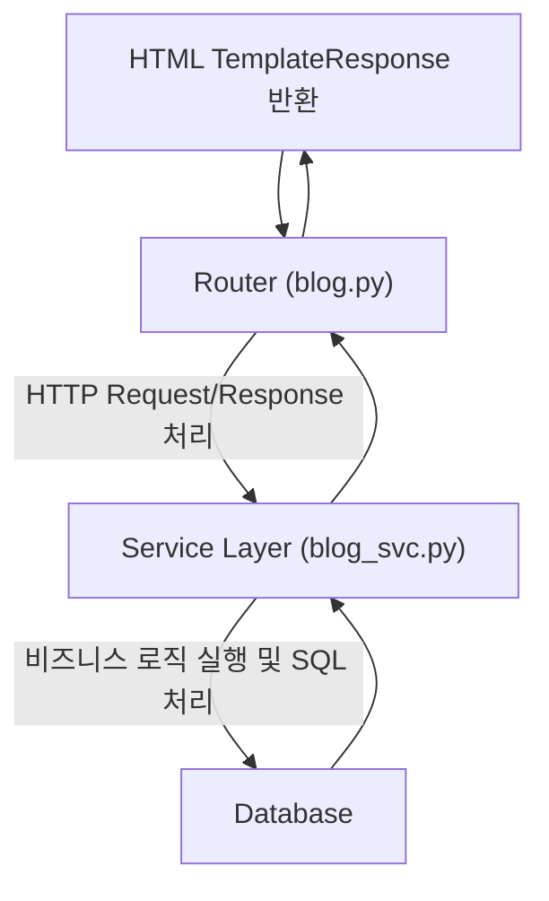

# Section 11 - 서비스 레이어(Service Layer) 도입 및 구조 개선

# 학습 주제
- Router, Service, DB 계층 분리를 통한 코드 구조 개선
- 비즈니스 로직과 라우터의 분리 -> 유지보수, 재사용성, 테스트 용이성 향상
- 라우터는 단순히 HTTP 요청과 응답만 담당 -> DB 관련 로직은 서비스 레이어에서만 처리
- 에러 처리를 서비스 레이어에 일원화하여 코드 중복 감소

# 구조 다이어그램
## 구조 다이어그램


# 섹션10 vs 섹션11의 주요 차이점
1. 구조
섹션10 : Router가 DB 쿠리, 비즈니스 로직 모두 처리
섹션11 : Service Layer 추가, Router는 단순히 서비스 호출
2. 유지 보수성
섹션10 : 수정 시 Router 코드를 직접 변경해야 함.
섹션11 : DB, 로직 수정은 Service 파일만 변경하면 됨.
3. 테스트 용이성
섹션10 : Router 테스트에 DB까지 포함됨 -> 무겁고 복잡
섹션11 : Service 레이어만 단위 테스트 가능
4. 에러 처리
섹션10 : 각 Router 함수마다 중복된 try/except 작성
섹션11 : Service 레이어에서 일괄 처리
5. 재사용성
섹션10 : 동일 로직을 여러 Router에서 중복 작성
섹션11 : Service 레이어의 함수 재사용 가능

# 기능별 상세 정리
# 1. 전체 블로그 조회 (Read All)
**변경된 이유**
- 섹션10 : Router에서 직접 SQL 실행
- 섹션11 : blog_svc.get_all_blogs()로 위임 -> Router는 단순히 HTML 반환
```python
#blog_svc.py
def get_all_blogs(conn: Connection) -> List:
    try:
        query = """
        SELECT id, title, author, content, image_loc, modified_dt FROM blog;
        """
        result = conn.execute(text(query))
        all_blogs = [BlogData(id=row.id,
              title=row.title,
              author=row.author,
              content=util.truncate_text(row.content),
              image_loc=row.image_loc, 
              modified_dt=row.modified_dt) for row in result]
        
        result.close()
        return all_blogs
    except SQLAlchemyError as e:
        print(e)
        raise HTTPException(status_code=status.HTTP_503_SERVICE_UNAVAILABLE,
                            detail="요청하신 서비스가 잠시 내부적으로 문제가 발생하였습니다.")
    except Exception as e:
        print(e)
        raise HTTPException(status_code=status.HTTP_500_INTERNAL_SERVER_ERROR,
                            detail="알수없는 이유로 서비스 오류가 발생하였습니다")
```
**변경 포인트**
- DB 쿼리 로직이 서비스 레이어로 이동
- BlogData 객체로 변환 후 Router로 반환

```python
#blog.py
@router.get("/")
def get_all_blogs(request: Request, conn: Connection = Depends(context_get_conn)):
    all_blogs = blog_svc.get_all_blogs(conn)

    return templates.TemplateResponse(
        request = request,
        name = "index.html",
        context = {"all_blogs": all_blogs}
    )
```
**변경 포인트**
- Router는 서비스 호출 + HTML TemplateResponse만 담당
- context에 all_blogs를 넘겨주어 Jinja2에서 렌더링
- **왜 Service Layer 함수에서 conn:Connection을 맨 앞에 두었는가?**
- 섹션 10에서는 Router 내부에서 직접 DB 작업을 했기 때문에 매개변수 순서가 FastAPI의 Form 처리 규칙을 따라야 했다. 

```python
# 섹션10 (Router 내부)
@router.post("/modify/{id}")
def update_blog(
    request: Request,
    id: int,
    title: str = Form(...),
    author: str = Form(...),
    content: str = Form(...),
    conn: Connection = Depends(context_get_conn) # 항상 마지막
)
```

- 하지만 섹션11에서는 FastAPI가 아닌 순수한 Python 함수로 동작하므로, Form 처리 규칙을 고려할 필요가 없다. 대신 서비스 레이터 함수 설계 원칙에 따라 순서를 바꾼 것이다. 또한 DB 연결 객체가 이 함수의 핵심 전제이자 실행 환경이라는 점을 명확히 보여주기 위함이다.

# 2. 특정 글 상세 조회 (Read One)
**변경된 이유**
- SQL 실행 및 예외 처리를 서비스 레이어에서만 담당
- Router는 blog_svc.get_blog_by_id() 호출 + 템플릿에 데이터 전달만 수행

```python
#blog_svc.py
def get_blog_by_id(conn: Connection, id: int):
    try:
        query = f"""
        SELECT id, title, author, content, image_loc, modified_dt from blog
        where id = :id
        """
        stmt = text(query)
        bind_stmt = stmt.bindparams(id=id)
        result = conn.execute(bind_stmt)
         
        if result.rowcount == 0:
            raise HTTPException(status_code=status.HTTP_404_NOT_FOUND,
                                detail=f"해당 id {id}는(은) 존재하지 않습니다.")

        row = result.fetchone()
        blog = BlogData(id=row[0], title=row[1], author=row[2], content=row[3],
                 image_loc=row[4], modified_dt=row[5])
        
        result.close()
        return blog

    
    except SQLAlchemyError as e:
        print(e)
        raise HTTPException(status_code=status.HTTP_503_SERVICE_UNAVAILABLE,
                            detail="요청하신 서비스가 잠시 내부적으로 문제가 발생하였습니다.")
    except Exception as e:
        print(e)
        raise HTTPException(status_code=status.HTTP_500_INTERNAL_SERVER_ERROR,
                            detail="알수없는 이유로 서비스 오류가 발생하였습니다")
```
```python
#blog.py
@router.get("/show/{id}")
def get_blog_by_id(request: Request, id: int,
                   conn: Connection = Depends(context_get_conn)):
    blog = blog_svc.get_blog_by_id(conn,id)
    blog.content = util.newline_to_br(blog.content)
    
    return templates.TemplateResponse(
        request = request,
        name="show_blog.html",
        context = {"blog": blog})
```
**변경된 점**
- 개행 처리(newline_to_br)
- Service layer는 비즈니스 로직만 담당해야하므로 DB에서 꺼내 데이터는 있는 그대로 반환한다.
- UI 관련 로직은 Router/Template의 역할이다.
- 그러므로 blog.py에 직접 blog.content = util.newline_to_br(blog.content)라고 적어준다.

# 3. 글 생성 (Create)
**변경된 이유**
- Service에서 Insert SQL 및 Commit/에러 처리 담당
- Router는 Form 데이터 수집 + 서비스 호출만 수행

```python
#blog_svc.py
def create_blog(conn: Connection, title : str, author: str, content: str):
    try:
        query = f"""
        INSERT INTO blog(title, author, content, modified_dt)
        values ('{title}', '{author}', '{content}', now())
        """
        conn.execute(text(query))
        conn.commit()

    except SQLAlchemyError as e:
        print(e)
        conn.rollback()
        raise HTTPException(status_code=status.HTTP_400_BAD_REQUEST,
                            detail="요청데이터가 제대로 전달되지 않았습니다.")

```
```python
#blog.py
@router.get("/new")
def create_blog_ui(request: Request):
    return templates.TemplateResponse(
        request = request,
        name = "new_blog.html",
        context = {}
    )

@router.post("/new")
def create_blog(request: Request
                , title = Form(min_length=2, max_length=200)
                , author = Form(max_length=100)
                , content = Form(min_length=2, max_length=4000)
                , conn: Connection = Depends(context_get_conn)):
    blog_svc.create_blog(conn, title=title, author=author, content=content)
    return RedirectResponse("/blogs", status_code=status.HTTP_302_FOUND)
```
**변경된 내용**
- context에 담길게 없더라도 content={}라고 처리해주기
- **왜 '{title}' 처럼 작은 따옴표('')가 필요한가?**
- SQL 문법상 문자열 값은 작은 따옴표로 감싸야 한다.
- VARCHAR, TEXT, DATETIME 등 문자열 계열 컬럼은 '값' 형태로 전달해야 한다.
- 숫자(INT,FLOAT)는 따옴표 없이 123처럼 바로 쓸 수 있다.
- 만약에 바인드 변수(:title)을 사용하면 자동으로 처리된다.
```python
# 바인드 변수를 쓰는 경우
query = "INSERT INTO blog(title, author, content, modified_dt) VALUES (:title, :author, :content, now())"
bind_stmt = text(query).bindparams(title=title, author=author, content=content)
conn.execute(bind_stmt)

```

# 4. 글 수정 (Update)
- **흐름** : modify_blog_html -> Form 데이터 전송 -> blog_svc.update_blog()

```python
#blog_svc.py
def update_blog(conn: Connection, id: int
                , title = str
                , author = str
                , content = str):
    
    try:
        query = f"""
        UPDATE blog 
        SET title = :title , author= :author, content= :content
        where id = :id
        """
        bind_stmt = text(query).bindparams(id=id, title=title, 
                                           author=author, content=content)
        result = conn.execute(bind_stmt)
        # 해당 id로 데이터가 존재하지 않아 update 건수가 없으면 오류를 던진다.
        if result.rowcount == 0:
            raise HTTPException(status_code=status.HTTP_404_NOT_FOUND,
                                detail=f"해당 id {id}는(은) 존재하지 않습니다.")
        conn.commit()
    except SQLAlchemyError as e:
        print(e)
        conn.rollback()
        raise HTTPException(status_code=status.HTTP_400_BAD_REQUEST,
                            detail="요청데이터가 제대로 전달되지 않았습니다. ")

```

```python
#blog.py
@router.get("/modify/{id}")
def update_blog_ui(request: Request, id: int, conn = Depends(context_get_conn)):
    blog = blog_svc.get_blog_by_id(conn,id=id)
    
    return templates.TemplateResponse(
        request = request,
        name="modify_blog.html",
        context = {"blog" : blog}
    )

@router.post("/modify/{id}")
def update_blog(request: Request, id: int
                , title = Form(min_length=2, max_length=200)
                , author = Form(max_length=100)
                , content = Form(min_length=2, max_length=4000)
                , conn: Connection = Depends(context_get_conn)):
    blog_svc.update_blog(conn=conn, id=id, title=title, author=author, content=content)
    return RedirectResponse(f"/blogs/show/{id}", status_code=status.HTTP_302_FOUND)
```

# 5. 글 삭제 (Delete)
```python
# blog_svc.py
def delete_blog(conn : Connection, id: int):
    try:
        query = f"""
        DELETE FROM blog
        where id = :id
        """

        bind_stmt = text(query).bindparams(id=id)
        result = conn.execute(bind_stmt)
        # 해당 id로 데이터가 존재하지 않아 delete 건수가 없으면 오류를 던진다.
        if result.rowcount == 0:
            raise HTTPException(status_code=status.HTTP_404_NOT_FOUND,
                                detail=f"해당 id {id}는(은) 존재하지 않습니다.")
        conn.commit()

    except SQLAlchemyError as e:
        print(e)
        conn.rollback()
        raise HTTPException(status_code=status.HTTP_503_SERVICE_UNAVAILABLE,
                            detail="요청하신 서비스가 잠시 내부적으로 문제가 발생하였습니다.")
```
```python
# blog.py
@router.post("/delete/{id}")
def delete_blog(request: Request, id: int
                , conn: Connection = Depends(context_get_conn)):
    blog_svc.delete_blog(conn=conn,id=id)
    return RedirectResponse("/blogs", status_code=status.HTTP_302_FOUND)
```

# 섹션 11 요약 - 왜 이렇게 구조를 바꿨는가?
# 개선된 구조 (섹션 11)
- **Service Layer(blog_svc.py) 도입**
- DB 쿼리 및 비즈니스 로직은 서비스에서만 담당
- Router는 HTTP 요청/응답과 템플릿 렌더링만 담당
- **에러 처리 일원화**
- DB와 관련된 에러는 서비스 레이어에서만 처리 → 중복 제거
- **의존성 주입(Depends)**
- Depends(context_get_conn)으로 DB 연결 관리 간소화
- 테스트 시 Service를 독립적으로 단위 테스트 가능
- **UI 처리 분리**
- 예) blog.content = util.newline_to_br(blog.content)는 UI에서만 필요한 처리 → Router에서 수행, Service는 DB에서 가져온 순수 데이터만 반환