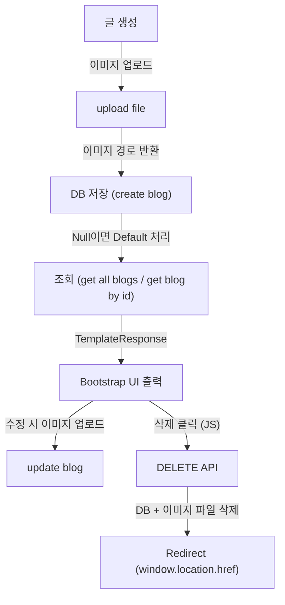

# Section 12 - Bootstrp 적용 및 File Upload

# 섹션 11과 섹션 12의 비교 요약
1. UI
- 섹션11 : 순수 HTML
- 섹션12 : Bootstrap 적용 (main_layout 상속, navbar/footer 추가)
2. 이미지
- 섹션11 : 텍스트 기반만 저장
- 섹션12 : 이미지 업로드 추가 (UploadFile 사용)
3. 조회
- 섹션11 : 단순 텍스트 출력
- 섹션12 : 이미지 표시 (Default 이미지 자동 처리)
4. 삭제
- 섹션11 : DB 데이터만 삭제
- 섹션12 : DB + 업로드 이미지 파일 삭제
5. Redirect 
- 섹션11 : Router에서 RedirectResponse
- 섹션12 : JS(fetch)로 클라이언트 단에서 Redirect

# 학습 주제
- Jinja2 템플릿에서 Bootstrap을 적용하여 UI 개선
- 이미지 업로드(File Upload) 처리 로직 구현
- 업로드된 이미지 경로를 DB에 저장하고 화면에 표시하는 방법 이해

# 1. Bootstrap 적용 (UI 개선)
- **변경 전 문제**
- 기존 UI는 순수 HTML 기반 -> 스타일링 부족, 가독성 낮음
- 동일한 레이아웃 반복 코드 존재 -> 유지보수 어려움
- **변경 후**
- Bootstrp CSS를 템플릿에 추가 -> 버튼, 카드, 폼 스타일 개선
- main_layout.html 레이아웃을 추가하여 공통 CSS/JS 관리

# 공통 레이아웃(index.html)
```html
<!--main_layout.html-->
<!DOCTYPE html>
<html lang="en">
<head>
    <meta charset="UTF-8">
    <meta name="viewport" content="width=device-width, initial-scale=1.0">
    <title>Simple Item UI</title>
    <link href="https://cdn.jsdelivr.net/npm/bootstrap@5.3.3/dist/css/bootstrap.min.css" rel="stylesheet" integrity="sha384-QWTKZyjpPEjISv5WaRU9OFeRpok6YctnYmDr5pNlyT2bRjXh0JMhjY6hW+ALEwIH" crossorigin="anonymous">
</head>
<body class="d-flex flex-column min-vh-100">
    <!-- Navbar -->
    
    <!-- End of Navbar-->

    <!-- Main Section -->
    
    
    <!-- End of Main Section -->

    <!-- Footer -->
    
    <!-- End of Footer -->
   
    <script src="https://cdn.jsdelivr.net/npm/bootstrap@5.3.3/dist/js/bootstrap.bundle.min.js" integrity="sha384-YvpcrYf0tY3lHB60NNkmXc5s9fDVZLESaAA55NDzOxhy9GkcIdslK1eN7N6jIeHz" crossorigin="anonymous"></script>

</body>
</html>
```
- **Bootstrap 사용시 추가해야할 내용**
- 다음 내용 추가하기 -> <link href="https://cdn.jsdelivr.net/npm/bootstrap@5.3.3/dist/css/bootstrap.min.css" rel="stylesheet" 
- 각 class 별로 나누어야 유지보수에 용이하다.
- 각 class를 추가할 때는 ****을 삽입하면 된다. footer부분도 마찬가지.
- main section에 내용을 넣을 때는 ****을 삽입한다.

```html

    
    <main class="px-3">
        <div class="container mt-4">
            <div class="row justify-content-center">
                <div class="col-lg-12">
                    
                    <div class="mb-4">
                        <h2 class="fw-bold">Item: {{ item.name }}</h2>
                        <p class="text-muted">{{ item.description }}</p>
                        <a href="#" class="btn btn-success">Learn More</a>
                    </div>
                    
                </div>                
            </div>
        </div>
    </main>
    
```
- 다음과 같이 content를 집어넣을 때는 **** 안에 작성하면 된다. **반드시  빼먹지 말기**
- **include와  extends의 가장 큰 차이점**은 include는 부분 파일 삽입이고 extends는 레이아웃 상속 및 블록 대체이다.

# 2. 이미지 업로드 (File Upload)
# 1. 학습 주제 및 변경 요약
- 기능 변화
- Bootstrap UI 적용 -> 블로그 목록 및 상세보기 화면 가독성 향상
- 이미지 업로드 기능 추가 (글 생성/수정 시 이미지 첨부 -> /static/uploads 경로에 저장)
- 글 삭제 시, DB 뿐 아니라 업로드된 이미지 파일까지 삭제
- 이미지가 없으면 기본 이미지 (/static/default/blog_default.png) 자동 표시

- 구조 변화
- .env에 UPLOAD_DIR 추가 (업로드 디렉토리 관리)
- main.py에 StaticFiles mount 추가 (정적 파일 URL 접근 가능)
- Service Layer에 파일 업로드 전용 함수 (upload_file) 추가
- SQL에서 이미지가 Null일 경우 기본 이미지 반환 로직 추가

# 2. 주요 흐름 다이어그램



# 3. 환경 설정 변경
1. **.env**
```python
UPLOAD_DIR="./static/uploads"
```
- 업로드 경로를 코드에 넣지 않고, 환경 변수로 관리

2. **main.py**
```python
from fastapi.staticfiles import StaticFiles

app.mount("/static", StaticFiles(directory="static"), name="static")
```
- 업로드된 이미지가 URL로 직접 접근 가능 (/static/uploads/...)
- 예) /static/uploads/둘리/myphoto_1721389201.png

# 4. 흐름별 코드 상세 분석
# 4.1 글 생성 (이미지 업로드 포함)
1. **HTML에서 Form 전송**
```html
<form action="/blogs/new" method="POST" enctype="multipart/form-data">

<!-- Image Input -->
<div class="mb-3">
    <label for="imagefile" class="form-label">Post Image</label>
    <input type="file" class="form-control" id="imagefile" name="imagefile" />
</div> 
```
- enctype="multipart/form-data" 필수 -> 파일 전송 허용
- 이미지가 첨부되지 않으면 imagefile.filename=""

2. **Router에서 처리 흐름**
```python
# blog.py
@router.post("/new")
def create_blog(request: Request
                , title=Form(...)
                , author=Form(...)
                , content=Form(...)
                , imagefile: UploadFile|None=File(None)
                , conn: Connection=Depends(context_get_conn)):
    image_loc = None
    if len(imagefile.filename.strip()) > 0:  
        image_loc = blog_svc.upload_file(author=author, imagefile=imagefile)  
        blog_svc.create_blog(conn, title=title, author=author, content=content, image_loc=image_loc)  
    else:
        blog_svc.create_blog(conn, title=title, author=author, content=content, image_loc=image_loc)
    return RedirectResponse("/blogs", status_code=status.HTTP_302_FOUND)
```
- **왜 upload_file()을 먼저 호출하는가?**
- 이미지 업로드 도중 실패하면 DB에서 잘못된 경로가 저장될 수 있기 때문이다.
- 업로드 성공 -> image_loc 생성 -> DB에 저장
- **len(imagefile.filename.strip()) > 0**
- 업로드된 파일명이 공백이 아닌지 체크, 파일이 선택되지 않았다면 업로드 로직을 건너뛴다. strip()은 혹시나 빈 공백만 들어오는 경우 방지

3. **Service - 업로드 처리 상세**
```python
# blog_svc.py
def upload_file(author: str, imagefile: UploadFile = None):
    user_dir = f"{UPLOAD_DIR}/{author}/"  # 작성자별 폴더
    if not os.path.exists(user_dir):
        os.makedirs(user_dir)  # 없으면 생성

    # 원본 파일명 + 타임스탬프 조합
    filename_only, ext = os.path.splitext(imagefile.filename)
    upload_filename = f"{filename_only}_{int(time.time())}{ext}"
    upload_image_loc = user_dir + upload_filename

    # 실제 OS에 저장 (1024 바이트씩 읽어서 쓰기)
    with open(upload_image_loc, "wb") as outfile:
        while content := imagefile.file.read(1024):
            outfile.write(content)

    return upload_image_loc[1:]  # "./" 제거 → URL 접근 가능
```
- **핵심 개념**
1. 작성자 별 폴더 분리 : /static/uploads/둘리/
2. 타임스탬프 추가 : myphoto_1721384645.png -> 중복 방지
- time.time() 사용
3. OS 경로 -> URL 경로 반환 :
- OS : ./static/uploads/...
- URL : /static/uploads/...
-> [1:]로 "." 제거

4. **Service - DB 저장**
```python
def create_blog(conn: Connection, title:str, author:str, content:str, image_loc=None):
    try:
        query = f"""
        INSERT INTO blog(title, author, content, image_loc, modified_dt)
        VALUES ('{title}', '{author}', '{content}', {util.none_to_null(image_loc, is_squote=True)}, now())
        """
        conn.execute(text(query))
        conn.commit()
```
- **왜 util.none_to_null()을 쓰는가?**
- Python의 None은 DB에 'None'이 아니라 Null로 저장돼야 함
- None이면 'None'이 아니라 Null로 들어가야 한다. 그냥 'None'으로 들어가면 문자열이 들어가는 것.
- image_loc='/static/uploads/...' → '/static/uploads/...' (작은 따옴표 필수)
- 숫자는 따옴표 없이, 문자열은 따옴표 필수 (SQL 문법 때문)

5. **Template에서 표시**
```html
<!--index.html-->

```
- DB image_loc가 Null -> Default 이미지 적용
- SQL에서 미리 처리
```python
SELECT CASE WHEN image_loc IS NULL THEN '/static/default/blog_default.png'
           ELSE image_loc END AS image_loc
FROM blog;

```
# 4.2 글 조회 (Default 이미지 처리)
**SQL로 Default 처리**
```python
def get_all_blogs(...):
    query = """
    SELECT id, title, author, content, 
    CASE WHEN image_loc IS NULL THEN '/static/default/blog_default.png'
         ELSE image_loc END AS image_loc,
    modified_dt
    FROM blog;
    """
```
**Python에서 Default 처리**
```python
rows = result.fetchall()
all_blogs = []
for row in rows:
    blog = BlogData(...)
    if blog.image_loc is None:
        blog.image_loc = '/static/default/blog_default.png'
    all_blogs.append(blog)

```
- **두 가지 방법 비교**
- 방식 : SQL
- 장점 : 데이터 조회 즉시 처리 -> 코드 간결, 단점 : SQL 복잡도 증가
- 방식 : Python
- 장점 : SQL 단순화, 단점 : 응용 계층에서 추가 반복문 필요

# 4.3 글 수정 (이미지 변경)
(글 생성과 동일 흐름, 다만 기존 이미지가 덮어쓰기 됨)
```python
@router.post("/modify/{id}")
def update_blog(..., imagefile:UploadFile|None=File(None)):
    image_loc=None
    if len(imagefile.filename.strip())>0:
        image_loc = blog_svc.upload_file(author=author, imagefile=imagefile)
    blog_svc.update_blog(conn=conn, id=id, title=title, author=author, content=content, image_loc=image_loc)

```
- **왜 len(imagefile.filename.strip()) 사용?**
- 새 이미지를 업로드한 경우에만 교체
- 업로드하지 않으면 기존 이미지 유지

# 4.4 글 삭제 (이미지 삭제 추가)
```python
# blog_svc.py
def delete_blog(conn: Connection, id: int, image_loc: str = None):
    conn.execute(text("DELETE FROM blog WHERE id=:id").bindparams(id=id))
    conn.commit()

    if image_loc is not None:
        image_path = "." + image_loc
        if os.path.exists(image_path):
            os.remove(image_path)

```
- os를 사용해서 image_path가 있으면 글 삭제할 때 이미지도 DB에서 같이 삭제하기
```html
<script>
async function confirmDelete() {
    if (confirm('해당 블로그를 정말 삭제하시겠습니까?')) {
        const url = "/blogs/delete/{{ blog.id }}";
        const response = await fetch(url, {method: 'DELETE'});
        if (response.ok) {
            window.location.href = "/blogs";  // ✅ JS에서 직접 Redirect
        }
    }
}
</script>
```
- 왜 JS로 삭제할까?
- RedirectResponse를 Router에서 사용하지 않는 이유 : DELETE 메서드는 페이지 이동을 포함하지 않는다. 즉 클라이언트(JS)에서 fetch()후, 성공 시 직접 페이지 이동 처리를 해야한다.


# 4.5 CRUD 흐름 요약
1. 생성
- 업로드 성공 후 image_loc DB 저장
2. 수정
- 이미지 새로 업로드 시 덮어쓰기, 업으면 그대로 유지
3. 조회
- image_loc이 Null -> Default 이미지 자동 대체
4. 삭제
- DB 삭제 + OS의 이미지 파일 삭제 + JS Redirect


