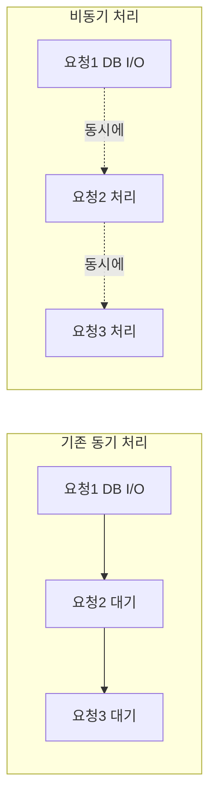

# Section 13 - 비동기(Asynchronous) DB 처리

# 학습 주제
- 기존 동기(Sync) 처리의 한계를 이해하고 비동기(Async) 방식으로 전환
- FastAPI의 async/await 동작 방식 학습
- SQLAlchemy 비동기 전용 엔진(create_async_engine) 및 aiofiles를 통한 비동기 파일 처리 구현
- CRUD 전반에서 await 흐름과 동시성(Concurrency) 향상 원리 이해

# 1. 동기 vs 비동기 비교
## 동기 vs 비동기 차이점
### * 기존(동기)
- 하나의 HTTP 요청이 DB와 통신하는 동안 I/O가 끝날 때 까지 **다음 요청은 대기해야함.**
- 예 : SELECT 쿼리로 3초 걸리면, 다른 요청도 3초 동안 기다려야함. (Blocking)
### * 변경 후 (비동기)
- DB I/O가 진행되는 동안 이벤트 루프가 **다른 요청을 동시에 처리 가능**
- 동일한 리소스로 더 많은 요청을 병렬 처리할 수 있음 (Non-blocking)
### * 언제 효과가 큰가?
- 초당 수십~수백 개의 동시 요청이 들어오는 상황
- DB 지연 시간이 큰 경우 (대용량 데이터 조회, 외부 API 연동 등)



# 2. 주요 변경 사항 요약 (동기 vs 비동기 비교)
1. **DB 엔진**
- 동기 : create_engine
- 비동기 : create_async_engine
2. **함수 정의**
- 동기 : def get_all_blogs()
- 비동기 : async def get_all_blogs()
3. **DB 연결**
- 동기 : conn = engine.connect()
- 비동기 : conn = await engine.connect()
4. **SQL 실행**
- 동기 : result = conn.execute(stmt)
- 비동기 : result = await conn.execute(Stmt)
5. **파일 쓰기**
- 동기 : with open(...) as f:
- 비동기 : async with aio.open(...) as f:
- 읽기는 read 그대로 쓰기

# 3. 코드 흐름 및 변경 포인트 (상세 분석)
## 1. database.py - 비동기 엔진 생성
```python
engine: AsyncEngine = create_async_engine(DATABASE_CONN,
                       pool_size=10, max_overflow=0,
                       pool_recycle=300)

```
- **create_async_engine** : 동기 create_engine 대신 사용
- **왜 QueuePool 주석 처리했는가?**
- 비동기에서는 SQLAlchemy가 자동으로 적절한 풀을 관리하며, QueuePool 강제 지정시 오류 발생 가능.
```python
async def direct_get_conn():
    conn = await engine.connect()   # 반드시 await
    return conn
```
- **핵심** : async def 함수 내부에서 DB 연결도 await 해야함.
- **짝 개념** : async def + await는 항상 함께 사용해야 함. (이벤트 루프에 제어권 반환)

## 2. blog.py - Router 비동기 전환
- **전체 CRUD 공통 변경**
- 모든 함수가 async def로 변경
- 서비스 호출 시 반드시 await 사용

```python
@router.get("/")
async def get_all_blogs(...):
    all_blogs = await blog_svc.get_all_blogs(conn)
```

- **글 생성 / 수정 - 이미지 업로드 흐름**
```python
if len(imagefile.filename.strip()) > 0:
    # upload_file이 먼저 실행되어야 함
    image_loc = await blog_svc.upload_file(author=author, imagefile=imagefile)
    await blog_svc.create_blog(...)
else:
    await blog_svc.create_blog(...)

```

## 3. blog_svc.py - 비동기 DB + 파일 처리
- **쿼리 실행**
```python
result = await conn.execute(text(query))  # 동기 execute → await execute 변경
```

- 비동기 파일 업로드 (upload_file)
```python
async with aio.open(upload_image_loc, "wb") as outfile:
    while content := await imagefile.read(1024):  
        await outfile.write(content)
```
- 왜 aiofile를 사용하는가?
- 동기 open()은 파일 쓰기 동안 이벤트 루프가 블로킹됨.
- aio.open()은 비동기 파일 입출력 지원 -> 동시성 유지.

# 4. FastAPI lifespan 사용 (애플리케이션 생명주기 관리)
## lifespan 이란?
- FastAPI 애플리케이션의 시작(Startup)과 종료(Shutdown) 단계에서 실행할 코드를 정의하는 방법
- 서버 시작 시 DB 초기화, 캐시 로딩 등 사전 작업.
- 서버 종료 시 DB 세션 종료, 커넥션 풀 해제 등 정리 작업에 사용.

## 코드 분석
```python
from contextlib import asynccontextmanager

@asynccontextmanager
async def lifespan(app: FastAPI):
    # 애플리케이션 시작 시 1회 실행
    print("Starting up...")
    yield  # 여기서 서버가 실행됨 (요청 처리 시작)

    # 애플리케이션 종료 시 1회 실행
    print("Shutting down...")
    await engine.dispose()  # DB Connection Pool 안전하게 반환

app = FastAPI(lifespan=lifespan)
```
## 동작 순서
1. Starting up...
- FastAPI가 실행되면서 lifespan의 시작 부분 실행
- DB 초기 연결, Redis 캐시 준비 등 리소스 준비 가능
2. yield
- 서버가 실제로 요청을 처리하는 메인 동작 단계
3. Shutting down...
- 서버 종료 시 호출됨.
- await engine.dispose()을 통해 DB Connection Pool을 안전하게 해제
- 만약 호출하지 않으면 세션/커넥션 누수 가능

## 왜 Section 13에서 lifespan이 필요한가?
- 비동기 엔진(AsyncEngine) 사용 시, 종료 시점에 명시적으로 연결 해제가 필요함
- 동기 엔진에서는 Python이 자동으로 GC(가비지 컬렉션)에서 정리할 수 있지만, 비동기에서는 이벤트 루프가 종료되기 전 직접 해제해야 안전.

# 5. 비동기 DB 쿼리 테스트 (execute_query)
## 코드
```python
from sqlalchemy import text
from db.database import direct_get_conn, engine
import asyncio

async def execute_query():
    conn = await direct_get_conn()
    print("conn type:", type(conn))
    query = "select * from blog"
    stmt = text(query)
    
    # 핵심 포인트: 비동기 DB 호출
    result = await conn.execute(stmt)  
    # ⬆️ conn.execute를 호출하면 클라이언트(DB 드라이버)가 쿼리를 던지고,
    # DB가 처리 완료될 때까지 응답을 기다림.
    # 이 "기다리는" 동안 await가 없으면 Event Loop가 멈추지만,
    # await가 있으면 Event Loop가 다른 요청을 먼저 처리 가능 (비동기 핵심)

    rows = result.fetchall()  
    # fetchall()은 await 필요 없음 (이미 응답이 도착한 CursorResult 객체에서 메모리에 가져오기만 함)
    print(rows)

    result.close()
    await conn.rollback()  
    # commit/rollback은 DB에 직접 명령을 보내야 하므로 await 필요

    await conn.close()  
    # close는 커넥션을 풀에 반환하는 작업 → 비동기 작업이므로 반드시 await 필요

    await engine.dispose()  
    # 프로그램 종료 시 커넥션 풀 완전 해제 (안 하면 세션 누수 가능)

async def main():
    await execute_query()

if __name__ == "__main__":
    asyncio.run(main())  # asyncio.run이 내부에서 Event Loop를 실행하므로 여기서는 await 필요 없음
```

## 핵심 개념 요약
1. **await conn.execute(stmt)**
- DB에 실제 쿼리를 던지는 시점
- DB가 응답할 때까지 I/O 작업이 발생하므로 await 필수
- **비동기 중요한 시점** : 이 대기 시간 동안 Event Loop는 다른 요청을 처리 가능

2. **result.fetchall()**
- 쿼리 실행이 끝난 후 이미 받아온 CursorResult에서 데이터를 꺼내는 작업
- CPU 작업(메모리에서 꺼내오기)만 하므로 await 필요 없음

3. **await conn.commit() / await conn.rollback()**
- 트랜잭션 확정/취소는 DB에 직접 명령을 던지는 I/O 작업 → await 필수

4. **await conn.close()**
- 커넥션을 닫고 풀에 반환 → 비동기 I/O 작업 → await 필수

5. **await engine.dispose()**
- 프로그램 종료 시 **모든 커넥션 풀 완전 해제**
- lifespan에서도 동일하게 수행 (서버 운영 시 필수)

6. **asyncio.run(main())**
- Python이 자체적으로 **이벤트 루프를 생성 후 main() 실행**
- main() 내부에서만 await 사용 가능, asyncio.run() 자체에는 await 필요 없음
